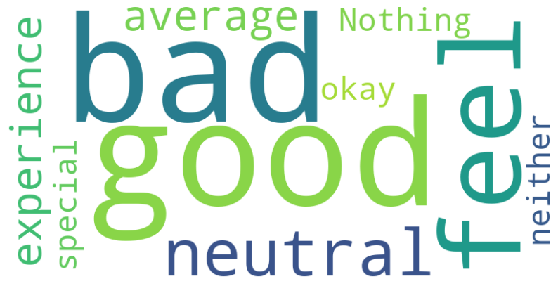

# Sentiment Analysis for Social Media
 

### **Submitted by**
1. **Aryan Paratakke** (PRN: 22070521070) [](https://github.com/Aryan152005)   
2. **Saumitra Patil** (PRN: 22070521077) [](https://github.com/saumitrapatil)   

**Group Number:** 60   
**Course:** B. Tech Computer Science and Engineering  
**Semester:** 6   
**Batch:** 2022-26

### **Under the Guidance of**
- **Dr. Latika Pinjarkar**  
- **Dr. Parul Dubey** (Capstone Project Coordinator)  

## Table of Contents
- [Introduction](#introduction)
- [Project Overview & Objectives](#project-overview--objectives)
- [Dataset](#dataset)
- [Data Preprocessing](#data-preprocessing)
- [Exploratory Data Analysis (EDA)](#exploratory-data-analysis-eda)
- [Modeling](#modeling)
- [Results](#results)
- [Future Scope](#future-scope)
- [Directory Structure](#directory-structure)
- [Conclusion](#conclusion)
- [References](#references)

## Introduction
Social media has become a major platform for individuals and businesses to express opinions, feedback, and sentiments. Understanding these sentiments can provide valuable insights into public perception, brand reputation, and societal trends. Sentiment analysis is a natural language processing (NLP) technique used to determine whether a piece of text expresses a positive, negative, or neutral sentiment.

This project focuses on analyzing sentiments from social media platforms like Twitter, Instagram, and Facebook using machine learning techniques. The insights generated from this analysis can help businesses in decision-making, social monitoring, and customer engagement strategies.

### Key Benefits of Sentiment Analysis
- **Brand Monitoring**: Companies can track customer satisfaction and sentiment regarding their products.
- **Market Analysis**: Identify emerging trends and consumer behavior.
- **Social Good**: Monitor public sentiment on social issues.
- **Political Analysis**: Gauge public opinion on policies and political events.

## Project Overview & Objectives
### Objectives
1. **Collect and preprocess** social media text data.
2. **Perform Exploratory Data Analysis (EDA)** to identify patterns in sentiments across different factors such as time, platform, and geography.
3. **Train multiple machine learning models** and compare their performance.
4. **Select the best-performing model** for sentiment classification.
5. **Provide insights and visualizations** for a better understanding of sentiment trends.
6. **Suggest future improvements** for enhancing accuracy and generalizability.

## Dataset
The dataset consists of tweets and social media posts with corresponding sentiment labels (Positive, Negative, Neutral). The dataset contains the following features:

- `Text`: The content of the post.
- `Sentiment`: Label indicating the sentiment of the text.
- `Timestamp`: Date and time of the post.
- `User`: The username of the post creator.
- `Platform`: The social media platform where the post originated (Twitter, Instagram, Facebook, etc.).
- `Hashtags`: Hashtags used in the post.
- `Retweets`: Number of times the post was shared.
- `Likes`: Number of likes received.
- `Country`: The country where the post was made.

### Data Visualization
#### Distribution of Sentiment Categories

 

## Data Preprocessing
### Functions Used
- `clean(text)`: Removes special characters, URLs, stopwords, and applies stemming.
- `null_count()`: Checks for missing values in the dataset.
- `df.duplicated().sum()`: Identifies duplicate entries in the dataset.
- `df['Platform'].value_counts()`: Provides insights into the distribution of social media platforms.

#### Sample Data Cleaning Code
```python
def clean(text):
    text = str(text).lower()
    text = re.sub(r'https?://\S+|www\.\S+', '', text)
    text = re.sub('[^a-zA-Z]', ' ', text)
    text = " ".join(text.split())
    return text

df['Clean_Text'] = df['Text'].apply(clean)
```

## Exploratory Data Analysis (EDA)
EDA helps in understanding trends in sentiment data. Some key insights:
- **Platform-based Sentiment**: Twitter had the highest number of negative sentiments.
- **Country-based Sentiment**: USA had the most social media activity.
- **Time-based Analysis**: Certain days and months showed higher positivity.
- **Word Cloud Representation**: The most common words for positive, negative, and neutral sentiments were analyzed visually.

### Example Word Cloud Visualization



## Modeling
### Machine Learning Models Used
1. Logistic Regression
2. Random Forest Classifier
3. Support Vector Machine (SVM)
4. Multinomial Naive Bayes
5. **Passive Aggressive Classifier** (Best Performing Model)

### Best Performing Model: Passive Aggressive Classifier
The Passive Aggressive Classifier is a fast and efficient model suitable for text classification tasks. It updates its weights aggressively when a misclassification occurs but remains passive when classifications are correct. This makes it well-suited for handling large-scale text data with real-time learning capability.

#### Model Training Code
```python
from sklearn.linear_model import PassiveAggressiveClassifier
from sklearn.feature_extraction.text import TfidfVectorizer
from sklearn.model_selection import train_test_split

X_train, X_test, y_train, y_test = train_test_split(df['Clean_Text'], df['Sentiment'], test_size=0.2, random_state=42)
vectorizer = TfidfVectorizer(max_features=5000)
X_train_tfidf = vectorizer.fit_transform(X_train)
X_test_tfidf = vectorizer.transform(X_test)

model = PassiveAggressiveClassifier()
model.fit(X_train_tfidf, y_train)
y_pred = model.predict(X_test_tfidf)
```

## Results
- **Best Accuracy:** **93.4%** (Passive Aggressive Classifier)
- **Most Frequently Used Words:** Word clouds showed frequent words in each sentiment category.
- **Time Trends:** Positive sentiments were more frequent on weekends.

## Future Scope
- **Deep Learning Models:** Using LSTMs, BERT, or Transformers for improved accuracy.
- **Multilingual Sentiment Analysis:** Expanding analysis to different languages.
- **Emotion Classification:** Going beyond positive/negative sentiment to detect emotions like anger, joy, or fear.

## Directory Structure
```
Sentiment-Analysis-Project/
│── data/
│   ├── sentimentdataset.csv
│── notebooks/
│   ├── Sentiment_Analysis.ipynb
│── README.md
│── requirements.txt
```

## Conclusion
This project successfully implemented sentiment analysis on social media data using NLP techniques. The **Passive Aggressive Classifier** was the best-performing model, achieving an accuracy of **93.4%**. Future enhancements could involve deep learning techniques for improved performance.

## References
- Scikit-learn Documentation: https://scikit-learn.org/stable/
- NLTK Documentation: https://www.nltk.org/
- Research Paper: "Sentiment Analysis in Social Media using Machine Learning Techniques" - https://doi.org/10.24996/ijs.2020.61.1.22

